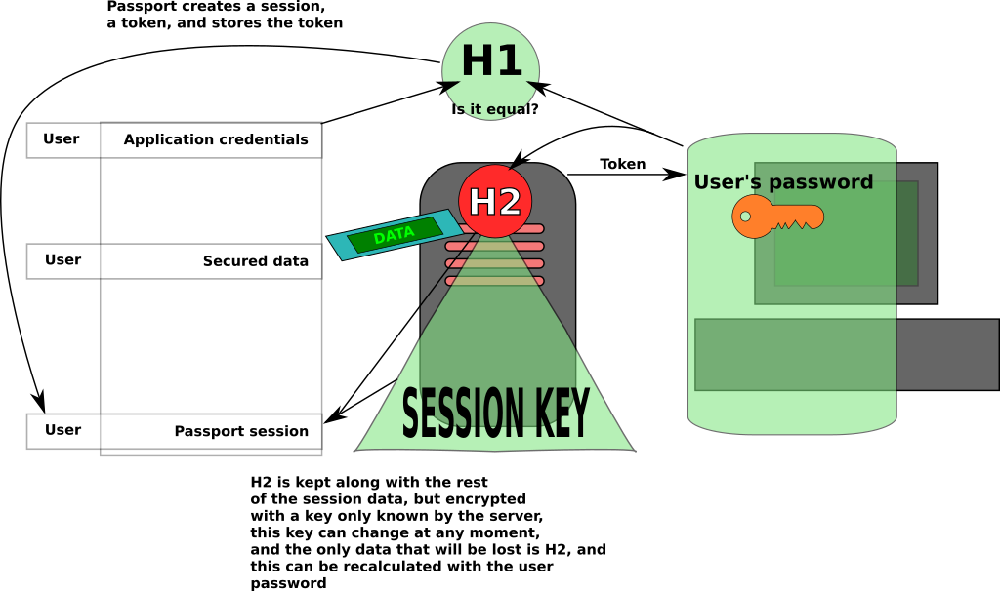

# Disclamer
Sereno is not still functional

# sereno
A RESTful key wallet extension of [passport](http://passportjs.org/)

# Overview
Sereno is intended to extend [passport](http://passportjs.org/)'s functionality, in order to include a key wallet giving access to encrypted data to authenticated users, while keeping this data as safe as possible.

https://github.com/chengxianga2008/node-cryptojs-aes

The archetypal use-case is an unified mail inbox, where some user will need to keep a list of all the users and passwords associated to his personal addresses.
Those passwords have to be kept safe, but the original information should be retrievable.

# Model
A detailed explanation [can be found here](doc/strategy-detail.md)



## Secure information

Typically

```
{
  plain-text: {_id: String, name: String},
  secured: {service: Url, user: String, key: String}
}
```

Please, note that the service Url has to be secured too, since a manipulation in that field could be used to make the server transfer the credentials to a wrong receiver.

The algorithm used to encrypt this information will be AES.

# Weak points
Please, report any problem you can think of about this strategy

# Howto
For common use-cases refer to the [how-to](doc/howto.md)

## Release History

* 0.0.1 Initial release

## Credits

 * [Luis Sieira](https://github.com/sieira)
 * [Jared Hanson](https://github.com/jaredhanson)
   * From whom the code in ./lib/utils.js has been taken

## License
Copyright [2015] [Luis Sieira Garcia]

Licensed under the Apache License, Version 2.0 (the "License");
you may not use this file except in compliance with the License.
You may [obtain a copy of the License](http://www.apache.org/licenses/LICENSE-2.0) at

    http://www.apache.org/licenses/LICENSE-2.0

Unless required by applicable law or agreed to in writing, software
distributed under the License is distributed on an "AS IS" BASIS,
WITHOUT WARRANTIES OR CONDITIONS OF ANY KIND, either express or implied.
See the License for the specific language governing permissions and
limitations under the License.
